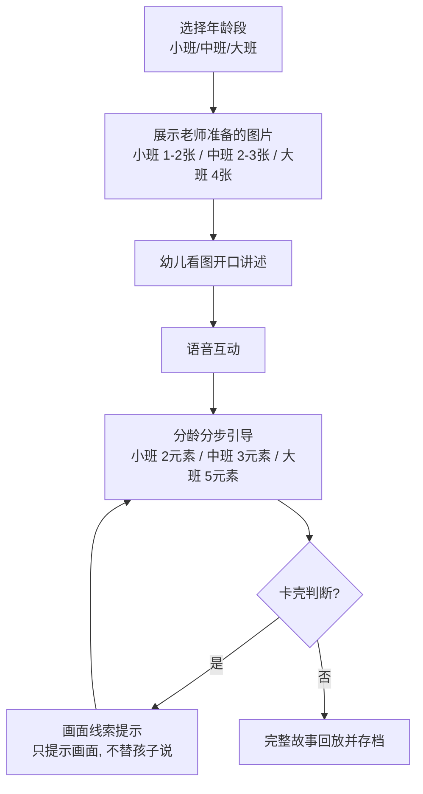

# 幼儿看图讲故事智能体 产品需求文档 (PRD)

> **方案提供方**：星洋智慧 (XingYang Intelligence)  
> **版本号**：V1.0  
> **编写日期**：2026-08-27  
> **技术平台**：Coze 智能体平台  

---

## 一、文档核心信息

| 字段 | 内容 |
| :--- | :--- |
| **文档名称** | 幼儿看图讲故事智能体 产品需求文档 |
| **版本号** | V1.0 |
| **技术平台** | Coze 智能体平台 |
| **编写日期** | 2026-08-27 |

---

## 二、需求概述

### 2.1 产品背景
在幼儿园语言领域教学活动中，看图讲故事是发展幼儿观察能力、想象力与连贯表达能力的重要方式。传统课堂上，教师精力有限，难以对每个孩子做到分龄选图、分步引导和个性化记录；幼儿讲不下去时，也常常得不到及时、恰当的画面提示。本方案基于 Coze 智能体平台搭建，让智能体陪伴幼儿看图讲故事，每个孩子都能在鼓励中讲出完整连贯的故事。

### 2.2 目标用户
- 幼儿园教师
- 3-6 岁幼儿（小班 / 中班 / 大班）

### 2.3 核心痛点
1. **传统看图讲述不分龄**：小中大班混用同一套图片，难度与认知水平不匹配。
2. **教师精力有限**：难以对每个孩子逐个分步引导、即时提示。
3. **卡壳缺乏线索支持**：幼儿说不下去时得不到画面线索提示，容易中断或放弃讲述。
4. **过程缺乏记录**：幼儿讲述过程难以完整记录，评价与反馈缺乏依据。

### 2.4 建设目标
基于 Coze 智能体平台搭建：
- 教师将固定图片预先放入智能体；
- 幼儿选择年龄段后，智能体展示对应数量的图片；
- 孩子开口用语音讲故事，全程语音互动；
- 智能体按分龄分步引导（小班引导「谁+干了什么」2 个元素、中班「谁+地点+干了什么」3 个元素、大班完整五要素 5 个元素）；
- 卡壳时只给画面线索提示、不替代幼儿表达，帮助每个孩子讲出完整连贯的故事。

---

## 三、核心功能

| 序号 | 功能 | 说明 |
| :--- | :--- | :--- |
| 1 | **分龄选图，匹配图片数量** | 教师提供固定图片放入智能体；幼儿选择小班/中班/大班后，自动展示对应数量（小班 1-2 张、中班 2-3 张、大班 4 张）。 |
| 2 | **语音讲述，语音互动** | 幼儿开口讲故事，全程语音互动，无需认字打字。 |
| 3 | **分龄分步引导** | 按年龄段引导不同数量的讲述要素：小班「谁+干了什么」、中班「谁+地点+干了什么」、大班完整五要素（谁+时间+地点+心理+干了什么），一次一问、由浅入深。 |
| 4 | **卡壳时画面线索提示** | 幼儿说不下去时只提示画面线索，引导孩子自己说出来，不替代表达。 |
| 5 | **完整故事回放与存档** | 把孩子的原话串联成完整故事回放，并自动存档供教师查看。 |

---

## 四、基于 Coze 的技术实现

本智能体在 Coze 智能体平台上搭建，由「智能体对话 + 工作流 + 插件」三部分组成：

| 组成 | 作用 | 对应能力 |
| :--- | :--- | :--- |
| **Coze 智能体** | 承载与教师和孩子的对话，理解年龄段选择与讲述内容 | 大模型对话、人设与回复逻辑 |
| **Coze 工作流** | 串联图片展示、语音互动、分步引导、卡壳提示等环节 | 分支判断（按年龄段）、节点编排 |
| **图片素材管理** | 存放教师预先上传的固定故事图片，按年龄段分类，供智能体按龄展示 | 固定图片资源、按龄调用 |
| **语音识别插件** | 支撑孩子语音互动，参与讲述记录与引导 | 普通话语音识别 |

---

## 五、运行流程

---

## 六、分龄标准

| 班级 | 年龄段 | 图片数量 | 引导要素 | 特点 |
| :--- | :--- | :--- | :--- | :--- |
| **小班** | 3-4 岁 | 1-2 张 | **谁 + 干了什么** (2个要素) | 单图为主、画面简洁、问句短 |
| **中班** | 4-5 岁 | 2-3 张 | **谁 + 地点 + 干了什么** (3个要素) | 可多图顺序、少量情节 |
| **大班** | 5-6 岁 | 4 张 | **完整五要素：谁 + 时间 + 地点 + 心理 + 干了什么** (5个要素) | 多图连贯、鼓励完整叙事 |

---

## 七、总结

本方案以「选择年龄段 → 展示老师准备的图片 → 幼儿看图开口讲 → 分龄分步引导 → 卡壳时画面线索提示 → 完整故事回放」为主线，基于 Coze 智能体平台搭建。故事图片由教师预先提供固定图片放入智能体，按年龄段分类使用；引导要素随年龄递增（小班 2 个、中班 3 个、大班 5 个），全程以鼓励为主、绝不替代幼儿表达，让每个孩子都能讲出属于自己的故事。
