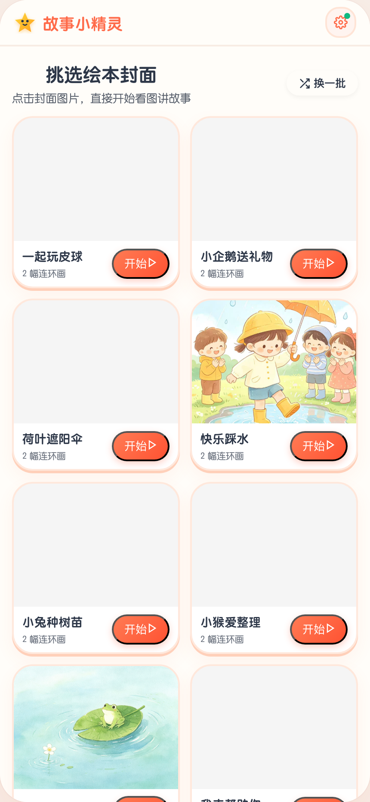
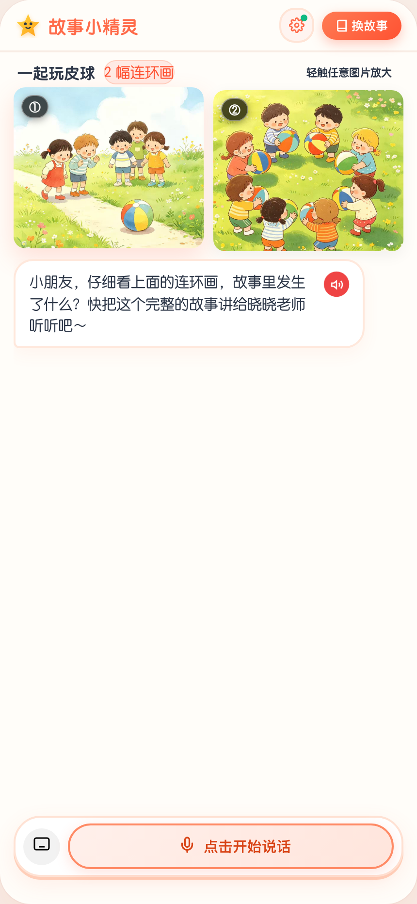

# 故事小精灵 (Story Elf) · 幼儿看图讲故事特级带教 AI Agent

> **专为 3-6 岁儿童心理学与语言发展设计的 AI 看图讲故事启蒙系统**。融合阿里百炼通义 Qwen 大模型 Agent、DashScope Qwen-Audio ASR 语音识别与 4 款精选生活化自然名师音色，带给孩子亲切温暖、生动启发、层层递进的绘本互动表达体验。

🌐 **在线体验地址**：[https://story.alphaintelligence.ltd](https://story.alphaintelligence.ltd)

---

## 📱 系统核心页面预览

| 01. 班级与年龄段选择 | 02. 精选绘本画廊挑选 |
| :---: | :---: |
|  |  |
| **分龄定制**：小班(3-4岁) / 中班(4-5岁) / 大班(5-6岁) 自适应难度 | **海量画册**：58 本精选原创连环画，支持换一批随机挑选 |

| 03. 启发式讲故事交互主页 | 04. 结业荣誉与能力评估报告 |
| :---: | :---: |
|  |  |
| **多模态启发**：分幅大图画卷、纯净 SVG 矢量麦克风、准确度点赞 | **学情报告**：通关奖杯、细节观察/语言表达/逻辑连贯三维评估 |

| 05. 4 款超自然真人名师音色与设置面板 |
| :---: |
|  |
| **生活化自然口语**：小晨老师(自然口语·推荐)、晓晓老师(温柔启发)、依依姐姐(活泼生动)、小雨姐姐(治愈轻声) |

---

## 🌟 核心功能亮点

### 1. 消除“AI 机械味”的超自然生活化名师音色库
- 🌿 **小晨老师（强烈推荐 · 默认）**：生活化口语女声，咬字轻柔自然，完全消除大厂新闻播音腔，如同邻家幼师在耳边面对面聊天；
- 🌸 **晓晓老师**：3-6岁特级名师声线，温润亲切，循循善诱；
- 🧸 **依依姐姐**：元气活泼的绘本电台主播，情感充沛，激发探索欲；
- 🍁 **小雨姐姐**：慢调舒缓治愈女声，适合睡前故事和专注力引导。

### 2. 纯净现代的界面交互设计
- **无 Emoji 干扰**：操作按钮（麦克风、键盘输入、状态指示等）全量采用精细高保真 SVG 矢量图标，杜绝视觉混乱；
- **4 套护眼儿童视觉主题**：糖果乐园（活力珊瑚橙）、森林秘境（清新薄荷绿）、星空探索（深邃星空蓝）、传统剪纸（梦幻丁香紫）。

### 3. 移动端 100% 顺畅适配（微信 / Android / iOS / 浏览器）
- 原生 AudioContext + 预先激活机制，绕过移动端 Autoplay 限制；
- 极速 ASR 语音识别：整句录制秒级转写并自动断句排版标点。

### 4. 顺应孩子表达的自然情商对话引擎
- 告别机械逐图死板逼问，根据孩子实际开口情况自适应引导；
- 故事通关后自动触发全屏礼花粒子与金奖杯荣誉卡，呈现【细节观察】、【语言表达】、【逻辑连贯】三维能力量化评估。

---

## 📁 目录结构

```text
TeachAgent/
├── docs/images/                # 系统核心页面超清截图
│   ├── 01_step_age.png         # 班级年龄段选择
│   ├── 02_step_story.png       # 绘本画廊挑选
│   ├── 03_step_interact.png    # 启发式对话主页 (含 SVG 矢量麦克风)
│   ├── 04_step_report.png      # 荣誉结业与表达能力报告
│   └── 05_settings_modal.png   # 4 款自然音色与设置面板
├── public/                     # 前端单页应用资产
│   ├── index.html              # 主应用入口 HTML
│   ├── style.css               # 4 套视觉主题完整 CSS
│   ├── app.js                  # 前端核心交互、音频录制与状态机
│   ├── story_data.js           # 58 本精选连环画结构化知识库
│   ├── audio_manifest.js       # 4 款音色高保真原声清单
│   └── story-assets/           # 连环画高清画册素材
├── functions/api/              # Cloudflare Pages Functions 无服务接口
│   ├── asr.js                  # 语音识别 API (Qwen-Audio-3.0-ASR-Flash)
│   ├── tts.js                  # 语音合成 API
│   ├── tts/voices.js           # 4 款自然名师音色配置服务
│   ├── stories.js              # 绘本故事清单过滤与元数据服务
│   └── session/
│       └── interact.js         # 启发式教学对话 Agent (Qwen3.8-Flash)
├── package.json
└── README.md
```

---

## 🚀 部署与运行

### 1. 本地启动
```bash
npm install
npm run start
# 浏览器访问: http://localhost:3000
```

### 2. 生产环境部署 (Cloudflare Pages)
```bash
npx wrangler pages deploy public --project-name teach-story-agent --branch=main
```
