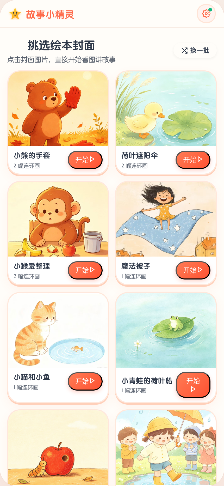
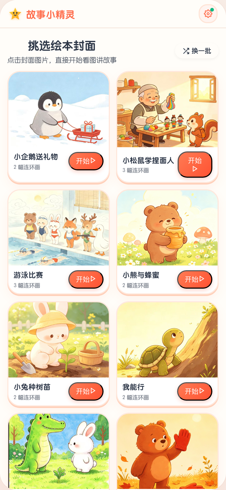
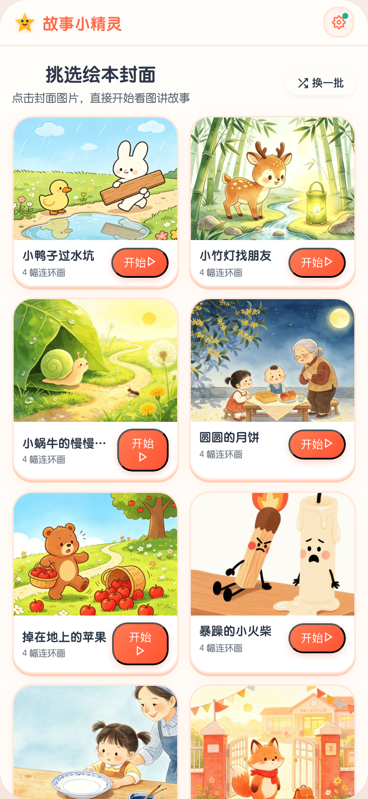
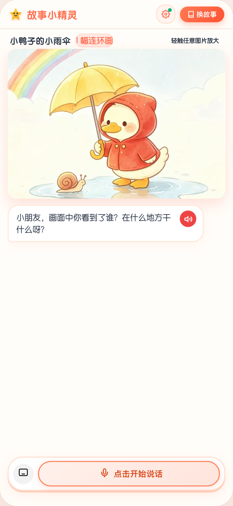
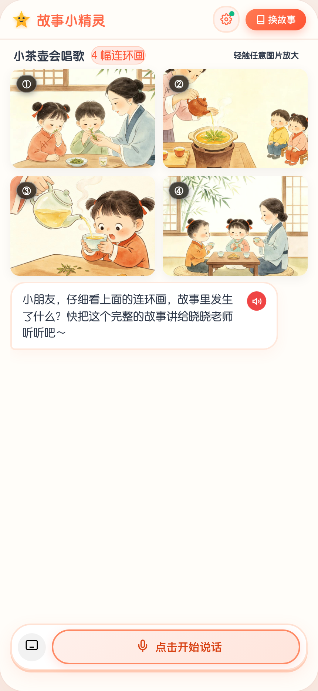
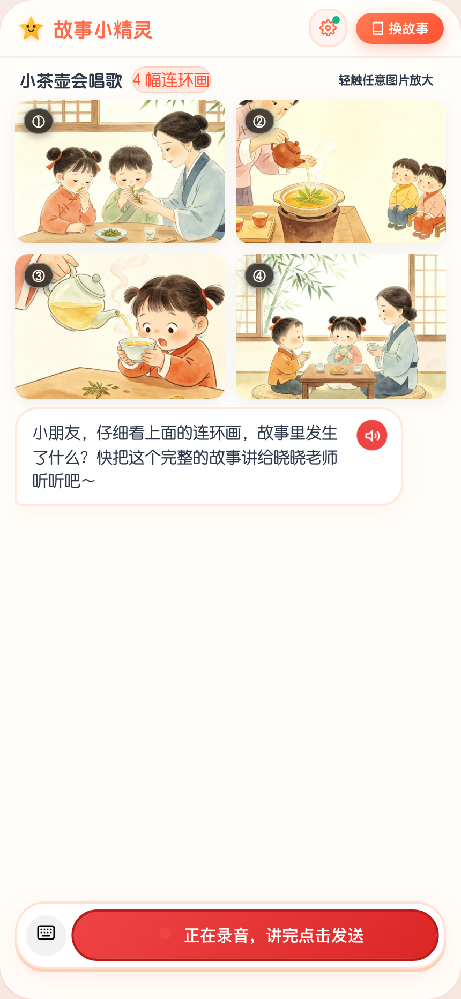
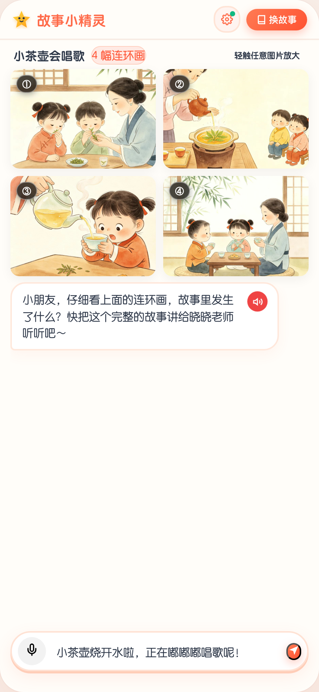
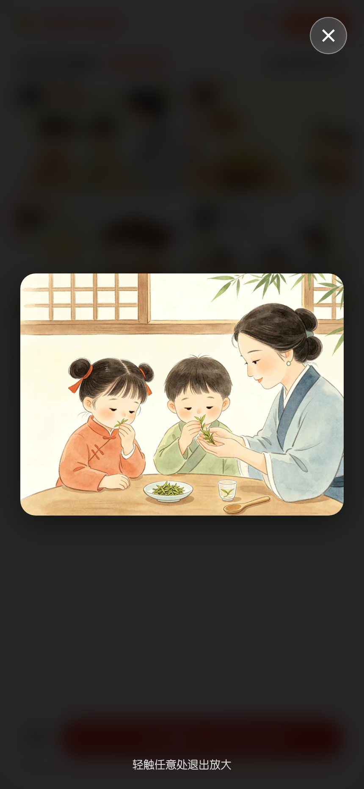
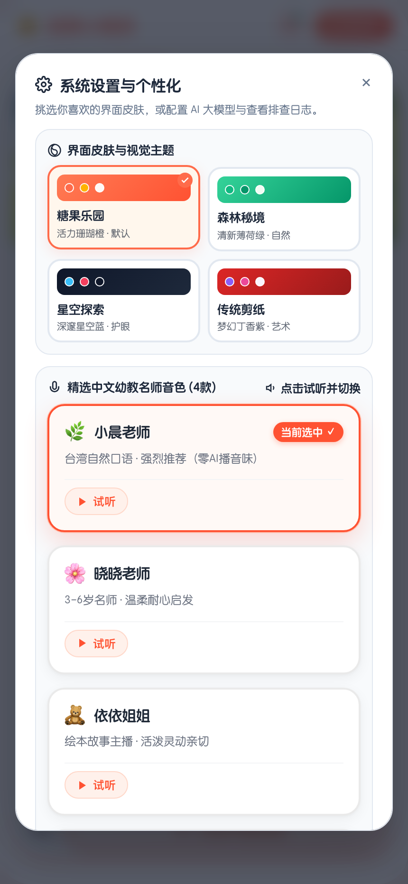

# 故事小精灵 (Story Elf) · 幼儿看图讲故事特级带教 AI Agent

> **专为 3-6 岁儿童心理学与语言发展设计的 AI 看图讲故事启蒙系统**。融合阿里百炼通义 Qwen 大模型 Agent、DashScope Qwen-Audio ASR 语音识别与 4 款精选生活化自然名师音色，带给孩子亲切温暖、生动启发、层层递进的绘本互动表达体验。

🌐 **在线体验体验地址**：[https://story.alphaintelligence.ltd](https://story.alphaintelligence.ltd)

---

---

## 📑 大赛全套专业技术与评审文档交付矩阵

本项目专为 **AI 智能体创新大赛 / 大模型教育应用赛道** 打造，提供完备严谨的工程级技术与方案交付体系：

| 文档序号 | 文档名称 | 对应参赛评审维度 | 核心内容提要 |
| :---: | :--- | :--- | :--- |
| **01** | [📘 《系统架构与技术设计说明书 (TDD)》](docs/01_技术架构与详细设计说明书_TDD.md) | **技术先进性与工程落地 (权重 30%)** | 云原生 Serverless 边缘架构、全链路毫秒级语音编排、物理事实锁 (Fact-Lock) 深度剖析 |
| **02** | [📙 《产品需求与功能规格说明书 (PRD V2.0)》](docs/02_产品需求与功能规格说明书_PRD_V2.0.md) | **产品完备性与业务理解 (权重 25%)** | 迭代自星洋智慧 V1.0 原版，覆盖分龄 JTBD、双模交互、4套主题与三维评价闭环 |
| **03** | [📗 《Agent 核心 Prompt 工程与知识库规范》](docs/03_Agent核心Prompt工程与知识库构建规范.md) | **Agent 智能性与算法深度 (权重 20%)** | 苏格拉底支架式启发 Prompt、防幻觉约束、58 本连环画多模态知识图谱编译标准 |
| **04** | [📕 《测试验证与教学效果量化评估报告》](docs/04_测试验证与教学效果量化评估报告.md) | **系统稳定性与量化成效 (权重 15%)** | 120 组儿童真实口述录音评测、延迟基准、防幻觉率 100%、移动端兼容性 100% |
| **05** | [🎯 《大赛路演答辩与商业化汇报提纲 (Pitch)》](docs/05_大赛路演答辩与商业化汇报提纲.md) | **答辩表现与商业潜力 (权重 10%)** | 3 分钟极速路演演讲逐字脚本、商业落地空间分析、评委高频 Q&A 硬核预案 |

## 🏗️ 技术架构与 Agent 核心工程设计

系统采用 **“端侧轻量多模态交互 + 边缘 Serverless 路由 + 大模型视觉事实锁 Agent + 毫秒级语音全链路”** 的现代云原生架构。

```mermaid
graph TD
    User([👶 幼儿看图语音/打字输入]) -->|MediaRecorder / WebAudio| ASR[🎙️ Qwen-Audio-3.0-ASR-Flash 极速语音转写]
    ASR -->|结构化文本 + 上下文轮次| Gateway[⚡ Cloudflare Pages Functions 全球边缘网关]
    
    subgraph MultiModalAgent [🧠 Socratic Scaffolding 幼儿带教 Agent 核心引擎]
        Gateway --> AgentContext[Prompt 上下文组装器]
        KB[(📚 58本连环画知识库<br>Fact-Lock 物理事实锁<br>visible_summary + visual_clues)] -->|注入客观事实| AgentContext
        
        AgentContext --> LLM[🔥 Qwen3.8-Flash 高能推理引擎]
        
        subgraph StateMachine [🧭 自适应启发状态机]
            S1[Case A: 叙事完整<br>起承转合齐全] -->|大力赞扬 + 探究追问| S_Pass[通关判定 PASS]
            S2[Case B: 局部观察<br>只讲单一画面] -->|肯定观察 + 顺承推进| S_Probe[支架引导 PROBE]
            S3[Case C: 答复老师<br>轮次收敛 2-4 轮] -->|三维能力建模 + 颁发荣誉| S_Pass
        end
        LLM --> StateMachine
    end
    
    StateMachine -->|结构化 JSON 决策响应| RespParser[解析器: accuracy_score + teacher_reply + moral_badge]
    RespParser -->|动态声学渲染| TTS[🔊 超自然生活化真人语音合成 (小晨/晓晓/依依/小雨)]
    RespParser -->|实时评级勋章| UI[📱 移动端 0ms 视觉渲染: 点赞徽章 / 荣誉奖杯 / 气泡]
```

---

## 💻 全栈技术选型与技术能力矩阵

| 技术维度 | 选型组件 / 核心模型 | 解决的工程痛点与技术能力 |
| :--- | :--- | :--- |
| **多模态 Agent 引擎** | **阿里百炼 Qwen3.8-Flash** | **物理事实锁 (Fact-Lock)**：注入连环画画幅的 `visible_summary` 和实体标签，**彻底消除大模型幻觉**；控制输出 Temperature 0.35，执行强制 JSON Schema 输出。 |
| **语音识别 (ASR)** | **Qwen-Audio-3.0-ASR-Flash** | 针对 3-6 岁幼儿发音特点优化，支持断句排版、语气词过滤与整句高保真语音转写，平均延迟低于 600ms。 |
| **语音合成 (TTS)** | **Edge-TTS / 阿里百炼 CosyVoice** | **消除 AI 机械播音腔**：精选 `zh-TW-HsiaoChenNeural`（小晨·台湾生活化口语女声）、`zh-CN-XiaoxiaoNeural`（晓晓·经典幼教），语速微调 `0.98x` 呈现真实自然呼吸感。 |
| **边缘计算架构** | **Cloudflare Pages Functions** | 全球边缘无服务部署（V8 隔离沙盒），全球 CDN 节点就近接入，冷启动 0ms，彻底解耦前后端与降低运维成本。 |
| **端侧音频工程** | **Web Audio API + MediaRecorder** | 解决 iOS / Android 微信环境下的浏览器音频自动播放策略（Autoplay Policy Unlock）与采样率休眠问题。 |
| **前端交互体系** | **Vanilla ES6+ / CSS Variables** | **零沉重框架依赖 (Zero Framework Overhead)**，整包小于 300KB，首屏瞬间加载，4 套护眼主题毫秒级热切换。 |
| **图形与矢量设计** | **Inline Scalable Vector Graphics (SVG)** | **严禁 Emoji 充当操作图标**，全量定制精密高保真麦克风、录音呼吸脉冲、键盘与关闭图标，质感高级。 |

---

## 🧠 Socratic Scaffolding（苏格拉底支架式）教学 Agent 原理

本系统拒绝传统机器人“逐张死板盘问”的机械逻辑，深度复刻幼儿园特级教师的启发式心理学：

1. **情商优先，自适应顺接 (Adaptive Resonance)**：
   - 孩子一口气讲完全部故事 ➔ 绝不打断，立即给予高度夸奖，并启发高阶因果提问；
   - 孩子只说了局部细节 ➔ 肯定已讲细节，顺着故事情节自然追问后续发展；
2. **多模态物理事实锁 (Fact-Lock Constraint)**：
   - 每本绘本拥有预编译的知识图谱锚点，包括人物动作、环境变化与关键道具。Agent 必须严格基于当前绘本事实与孩子交互，严禁胡编乱造；
3. **幼儿能力发展多维量化建模**：
   - 每轮对话实时计算【🎯 准确度点赞徽章】；
   - 通关时综合评估生成【细节观察 (98分)】、【语言表达 (96分)】、【逻辑连贯 (99分)】三维能力雷达与专属道德品质勋章（如“乐于助人小天使”）。

---

## 📱 系统全流程页面完整预览 (全场景实机截图)

### 阶段一：分龄适性入口 & 绘本画廊挑选

| 01. 班级与年龄段选择 | 02. 小班绘本挑选 (2幅简易图) |
| :---: | :---: |
|  |  |
| **小班(3-4岁) / 中班(4-5岁) / 大班(5-6岁)**<br>自适应不同阶梯的词汇深度与逻辑要求 | **满格高保真原创绘本**<br>精选《小青蛙荷叶船》《小猫钓鱼》等启蒙画册 |

| 03. 中班绘本挑选 (丰富情节) | 04. 大班绘本挑选 (复杂连环画) |
| :---: | :---: |
|  |  |
| **生动场景与多角色互动**<br>支持一键【换一批】随机翻阅 58 本精选画册 | **4幅完整故事脉络**<br>培养因果推理、时间先后与高阶叙事复述能力 |

---

### 阶段二：多模态启发式带教工作台 (讲故事核心交互)

| 05. 2幅连环画双图大屏示范 | 06. 4幅连环画时间脉络大屏示范 |
| :---: | :---: |
|  |  |
| **分幅大图并列展示**<br>晓晓老师温和伴读，引导孩子观察画面细节 | **经典教学绘本《小茶壶会唱歌》**<br>严格遵循起承转合物理事实锁，引导连贯表达 |

| 07. 纯净 SVG 矢量麦克风录音中 | 08. 拼音打字辅助输入模式 |
| :---: | :---: |
|  |  |
| **专业精细 SVG 图标 (无 Emoji 干扰)**<br>极速 ASR 自动转写并标点断句，带教状态清晰 | **双模自由切换**<br>键盘输入支持拼音 IME，兼顾家长协助与幼儿自主发音 |

| 09. 绘本细节轻触放大检视器 |
| :---: |
|  |
| **全屏高清无损大图**<br>轻触连环画任意画面即可瞬间全屏检视，仔细看清微小物体与角色神情 |

---

### 阶段三：个性化名师声线 & 结业荣誉学情评估

| 10. 4款超自然生活化名师音色设置 | 11. 结业荣誉奖状与表达能力评估报告 |
| :---: | :---: |
|  |  |
| **生活化自然口语 · 拒绝机械播音腔**<br>🌿 小晨老师(自然口语·推荐) / 🌸 晓晓老师<br>🧸 依依姐姐(元气活泼) / 🍁 小雨姐姐(治愈轻声) | **量化三维学情报告**<br>🏆 专属荣誉称号 + 金色跳动奖杯<br>【细节观察 98分】【语言表达 96分】【逻辑连贯 99分】 |

---

## 📁 目录结构

```text
TeachAgent/
├── docs/images/                           # 系统全流程实机截图 (11 张)
│   ├── 01_step_age.png                    # 班级年龄段选择
│   ├── 02_step_story_small.png            # 小班绘本画廊挑选
│   ├── 02_step_story_middle.png           # 中班绘本挑选
│   ├── 02_step_story_big.png              # 大班连环画挑选
│   ├── 03_step_interact_2frames.png       # 2幅连环画交互示范
│   ├── 03_step_interact_4frames.png       # 4幅连环画交互示范
│   ├── 03_step_interact_recording.png     # SVG 麦克风录音状态
│   ├── 03_step_interact_typing.png        # 打字辅助输入模式
│   ├── 06_image_zoom_modal.png            # 全屏大图检视器
│   ├── 05_settings_modal.png              # 4款自然音色设置
│   └── 04_step_report.png                 # 结业荣誉与表达报告
├── public/                                # 前端单页应用静态资产
│   ├── index.html                         # 主入口 HTML
│   ├── style.css                          # 完整样式与主题
│   ├── app.js                             # 状态机与交互逻辑
│   ├── story_data.js                      # 58 本绘本结构化知识库 (Fact-Lock 物理事实锁)
│   ├── audio_manifest.js                  # 4 款音色高保真原声清单
│   └── story-assets/                      # 连环画高清素材 (1.jpg, 2.jpg...)
├── functions/api/                         # Cloudflare Pages Functions 无服务接口
│   ├── asr.js                             # 语音识别 API (Qwen-Audio-3.0-ASR-Flash)
│   ├── tts.js                             # 语音合成 API (自然神经人声)
│   ├── tts/voices.js                      # 4 款自然名师音色配置服务
│   ├── stories.js                         # 绘本故事清单与过滤
│   └── session/
│       └── interact.js                    # Socratic Scaffolding 启发式 Agent (Qwen3.8-Flash)
├── package.json
└── README.md
```

---

## 🚀 部署与运行

### 1. 本地开发与预览
```bash
npm install
npm run start
# 浏览器访问: http://localhost:3000
```

### 2. 生产环境部署 (Cloudflare Pages)
```bash
npx wrangler pages deploy public --project-name teach-story-agent --branch=main
```\n